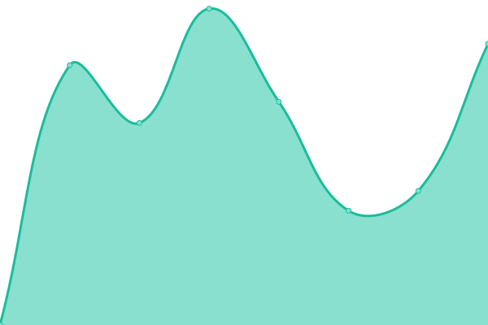
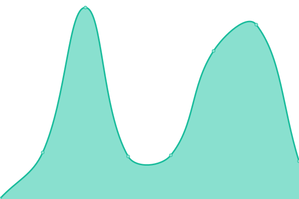
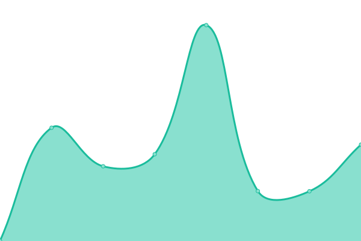
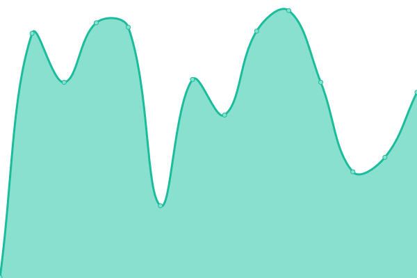

# [📈 Live Status](https://demo.upptime.js.org): <!--live status--> **🟧 Partial outage**

This repository contains the open-source uptime monitor and status page for [Matias Sanchez](https://demo.upptime.js.org), powered by [Upptime](https://github.com/upptime/upptime).

With [Upptime](https://upptime.js.org), you can get your own unlimited and free uptime monitor and status page, powered entirely by a GitHub repository. We use [Issues](https://github.com/MatiasL13/status-page/issues) as incident reports, [Actions](https://github.com/MatiasL13/status-page/actions) as uptime monitors, and [Pages](https://demo.upptime.js.org) for the status page.

<!--start: status pages-->
<!-- This summary is generated by Upptime (https://github.com/upptime/upptime) -->
<!-- Do not edit this manually, your changes will be overwritten -->
<!-- prettier-ignore -->
| URL | Status | History | Response Time | Uptime |
| --- | ------ | ------- | ------------- | ------ |
|  [CasaHo](http://www.intranet-casaho.com.ar) | 🟩 Up | [casa-ho.yml](https://github.com/MatiasL13/status-page/commits/HEAD/history/casa-ho.yml) | 

 551ms
     
 | 

<a href="https://demo.upptime.js.org/history/casa-ho">99.61%</a>
    

|  [Moho](http://www.intranet-moho.com.ar) | 🟥 Down | [moho.yml](https://github.com/MatiasL13/status-page/commits/HEAD/history/moho.yml) | 

 0ms
     
 | 

<a href="https://demo.upptime.js.org/history/moho">0.00%</a>
    

|  [Hacker News](https://news.ycombinator.com) | 🟩 Up | [hacker-news.yml](https://github.com/MatiasL13/status-page/commits/HEAD/history/hacker-news.yml) | 

 312ms
     
 | 

<a href="https://demo.upptime.js.org/history/hacker-news">100.00%</a>
    

|  [Doctor-arganaraz](http://www.doctor-arganaraz.com.ar) | 🟩 Up | [doctor-arganaraz.yml](https://github.com/MatiasL13/status-page/commits/HEAD/history/doctor-arganaraz.yml) | 

 405ms
     
 | 

<a href="https://demo.upptime.js.org/history/doctor-arganaraz">100.00%</a>
    

|  [Animate](http://animatesrlsistema.com.ar) | 🟥 Down | [animate.yml](https://github.com/MatiasL13/status-page/commits/HEAD/history/animate.yml) | 

 0ms
     
 | 

<a href="https://demo.upptime.js.org/history/animate">0.00%</a>
    

|  [sonarQ](https://sonarqube.dev.securitize.io) | 🟩 Up | [sonar-q.yml](https://github.com/MatiasL13/status-page/commits/HEAD/history/sonar-q.yml) | 

 324ms
     
 | 

<a href="https://demo.upptime.js.org/history/sonar-q">95.97%</a>
    

<!--end: status pages-->

[**Visit our status website →**](https://demo.upptime.js.org)

## 📄 License

- Powered by: [Upptime](https://github.com/upptime/upptime)
- Code: [MIT](./LICENSE) © [Matias Sanchez](https://demo.upptime.js.org)
- Data in the `./history` directory: [Open Database License](https://opendatacommons.org/licenses/odbl/1-0/)
